## Nama : Ferzy Triwarsana Putra
## NIM : 2110131310003

# Komponen Sistem Operasi, Layanan Sistem Operasi  dan Sistem Call

## Komponen Sistem Operasi

Pada kenyataannya tidak semua sistem operasi mempunyai struktur yang sama. Namun menurut Avi Silberschatz, Peter Galvin, dan Greg Gagne, umumnya sebuah sistem operasi modern mempunyai komponen sebagai berikut:

Komponen Sistem Secara Umum

* Manajemen Proses
* Manajemen Memori Utama
* Manajemen File
* Manajemen Sistem I/O (input dan output)
* Manajemen Sekunder / Secondary
* Jaringan
* Sistem Proteksi
* Command-Interpreter Sistem

### Manajemen Proses

Proses adalah keadaan ketika sebuah program sedang dieksekusi. Sebuah proses membutuhkan beberapa sumber daya untuk menyelesaikan tugasnya. Sumber daya tersebut dapat berupa CPU time, memori, berkas-berkas, dan perangkat-perangkat I/O. Dalam hal manajemen proses, sistem operasi bertanggung jawab atas aktifitas-aktifitas yang berkaitan dengan manajemen proses seperti:

* Pembuatan dan penghapusan proses pengguna dan sistem proses
* Menunda atau melanjutkan proses
* nyediakan mekanisme untuk proses sinkronasi
* Menyediakan mekanisme untuk proses komunikasi
* Menyediakan mekanisme untuk penanganan deadblock

Contoh Manajemen Proses pada linux:
1. Perintah "top"

“top” adalah aplikasi di Linux yang dijalankan melalui Terminal di Linux. Aplikasi ini digunakan untuk memanajemen proses Linux tanpa menggunakan GUI. Saat dieksekusi, aplikasi ini akan menampilkan daftar semua proses yang sedang berjalan dan setiap detik akan diperbaharui. Proses yang ditampilkan pada perintah “top” adalah yang paling besar menggunakan sumber daya.

Tampilan perintah “top” dapat Anda lihat pada gambar di bawah ini:

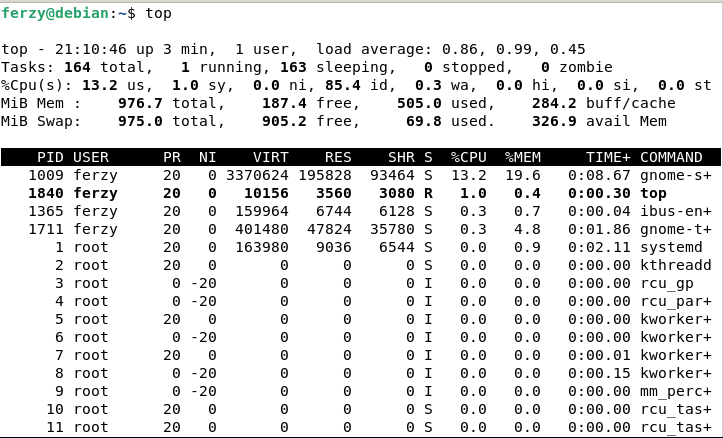

        Tampilan informasi proses menggunakan “top”.

Berikut ini beberapa keyboard shortcut yang dapat Anda gunakan untuk navigasi:

* keyboard shortcut "h" atau "?" berfungsi untuk Menampilkan jendela bantuan.

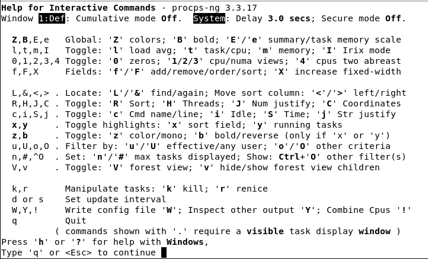

        Tampilan ketika menekan keyboard shortcut "h" atau "?"

* keyboard shortcut "f" berfungsi untuk Menghapus atau menambahkan field di layout.

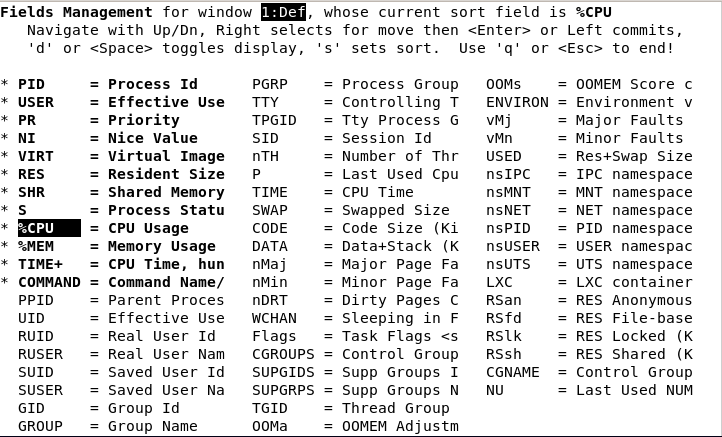

        Tampilan ketika menekan keyboard shortcut "f"

* keyboard shortcut "l" berfungsi untuk Menampilkan atau menghilangkan tampilan informasi beban rata-rata dan informasi uptime.

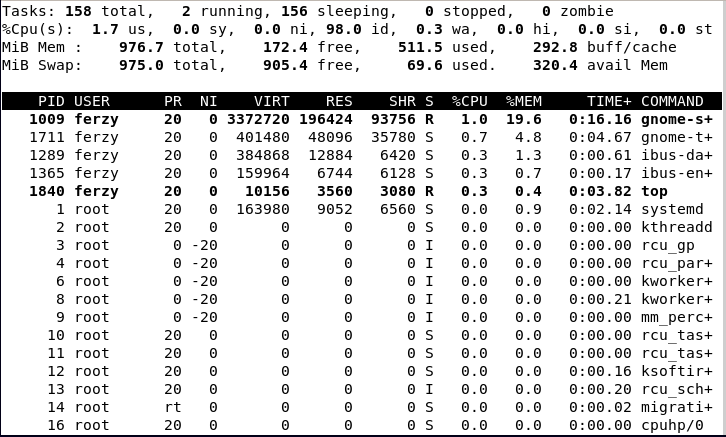

        Tampilan ketika menekan keyboard shortcut "l"

* keyboard shortcut "m" berfungsi untuk Menampilkan atau menghilangkan tampilan informasi memori.

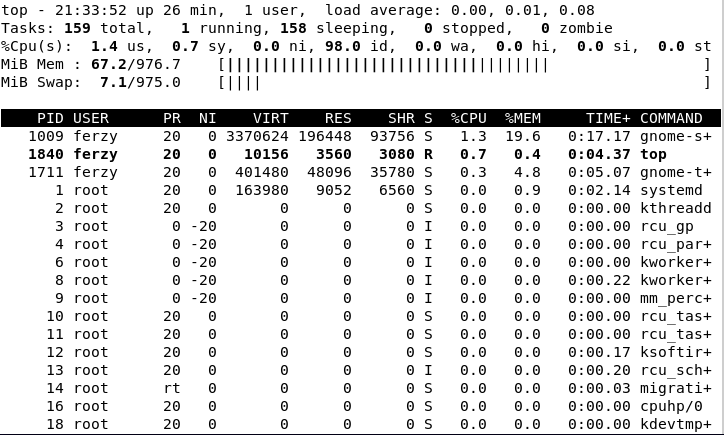

        Tampilan ketika menekan keyboard shortcut "m"

* keyboard shortcut "space" berfungsi untuk Digunakan untuk memperbaharui tampilan atau me-refresh tampilan dengan data terbaru tanpa menunggu waktu refresh.

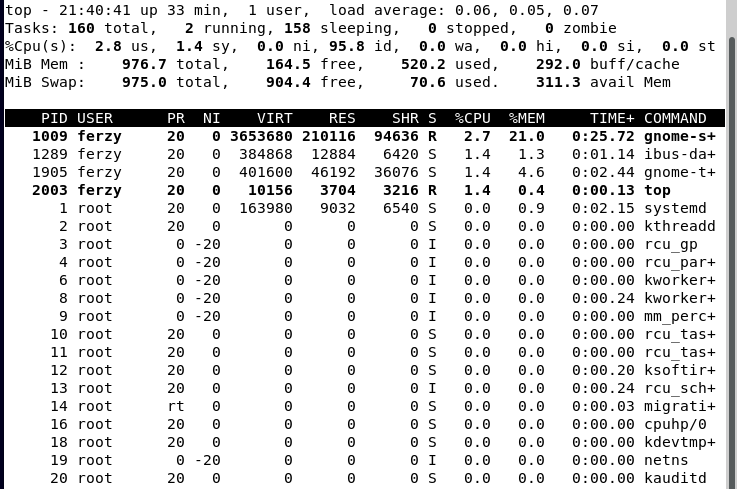

        Tampilan ketika menekan keyboard shortcut "space"

Saat menjalankan perintah “top”, Anda dapat menggunakan beberapa opsi tampilan yang ingin ditampilkan. seperti dibawah ini.

Tampilan perintah “top -h” dapat Anda lihat pada gambar di bawah ini:

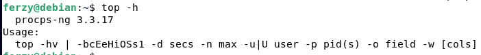

        Tampilan informasi proses menggunakan “top -h”.

Tampilan perintah “top -H” dapat Anda lihat pada gambar di bawah ini:

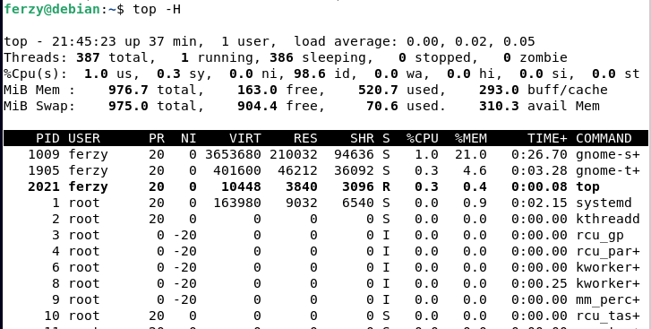

        Tampilan informasi proses menggunakan “top -H”.

### Manajemen Memori Utama

Memori utama atau lebih dikenal sebagai RAM memori adalah sebuah array yang besar dari word atau byte, yang ukurannya mencapai ratusan, ribuan, atau bahkan jutaa. Setiap word atau byte mempunyai alamat tersendiri. Memori Utama berfungsi sebagai tempat penyimpanan yang akses datanya digunakan oleh CPU atau perangkat I/O. Memori utama termasuk tempat penyimpanan data yang sementara (volatile), artinya data akan hilang begitu sistem komputer dimatikan. Dalam hal manajemen memori, sistem operasi bertanggung jawab atas aktifitas-aktifitas yang berkaitan dengan manajemen memori seperti:

* Melacak bagian utama dari memori yang sedang digunakan & oleh siapa.
* Memutuskan proses-proses mana yang di-load ke ruang memori saat tersedia.
* Alokasi & dealokasi ruan memori.

Contoh Manajemen Memori Utama pada linux:
1. VmStat (Virtual Memory Statistics)
VmStat merupakan perintah pada Linux yang berfungsi untuk menampilkan penggunaan memori, swap, memberikan informasi interrupt system, kecepatan I/O, statistik CPU secara real time, dan proses apa saja yang sedang berjalan. 

Untuk mengaksesnya ketikkan command dibawah ini pada Terminal:
vmstat

Berikut tampilannya jika telah menjalankan command vmstat:

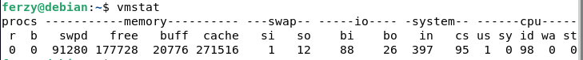

        Contoh tampilan vmstat

### Manajemen Memori Sekunder

Karena memori utama (primary storage) bersifat volatile dan terlalu kecil untuk penyimpanan semua data dan program secara permanen, maka sistem komputer harus menyediakan secondnary storage untuk mem-backup memori utama. Sistem komputer modern menggunakan disk sebagai media on-line storage, yang digunakan untuk program dan data. Sistem operasi bertanggung jawab untuk aktifitas yang berhubungan dengan manajemen disk:

* Bagaimana mengelola ruang yang kosong dalam storage.
* Bagaimana mengalokasi storage.
* Bagaimana melakukan scheduling penggunaan disk.

### Manajemen File

File adalah kumpulan informasi yang berhubungan sesuai dengan tujuan pembuat file tersebut. File dapat mempunyai struktur yang bersifat hierarkis (direktori, volume, dll). Sistem operasi memberikan tanggapan atas manajemen file untuk aktifitas-aktifitas berikut:

* Pembuatan dan penghapusan file,
* Pembuatan dan penghapusan direktori,
* Mendukung primitif-primitif manipulasi file dan direktori,
* Pemetaan file dalam secondnary storage,
* Backup file dalam media yang stabil (non-volatile).

Contoh Manajemen File pada linux:
1. mkdir
Gunakan command mkdir ketika Anda perlu membuat folder atau directory. Misalnya, Anda ingin membuat sebuah directory dengan nama “Baru”, maka Anda tinggal memasukkan command “mkdir Baru”.

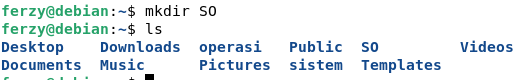

        contoh pembuatan folder

2. cd
Gunakan command “cd” untuk masuk ke sebuah directory. Misalnya, jika Anda sedang ada di folder home dan Anda ingin masuk ke folder yang baru saja dibuat yaitu SO, Anda bisa memasukkan command “cd SO”.

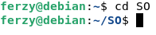

        contoh masuk ke directory atau folder

3. touch
touch digunakan untuk membuat file baru. Ini bisa berupa apa saja, mulai dari txt file kosong atau file zip kosong. Misalnya Anda ingin membuat file text baru, Anda tinggal masukkan “touch tugas3.txt”.

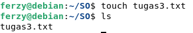

        contoh membuat file

4. mv
mv digunakan untuk memindahkan files. Anda juga bisa menggunakan perintah dasar ini untuk mengganti nama sebuah file. Misalnya, Anda ingin mengganti nama sebuah file dari “baru” menjadi “lama”. Maka Anda tinggal memasukkan command “mv tugas3 tugas”.

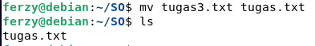

        contoh mengganti nama file

5. rm
Command rm adalah perintah dasar linux yang digunakan untuk menghapus direktori dan file. Jadi misalnya Anda ingin menghapus file yang bernama “tugas.txt”, Anda tinggal masukkan command “rm tugas.txt”. Tetapi perintah dasar ini tidak bisa sembarangan menghapus direktori. Gunakan rm -r untuk menghapus direktori. Ini akan menghapus direktori dan isinya.

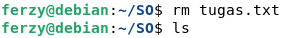

        contoh menghapus file

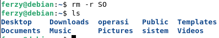

        contoh menghapus folder

### Manajemen Input Output

Manajemen input output sering disebut device manager. Menyediakan "device driver" yang umum sehingga I/O dapat seragam (membuka membaca, menulis, menutup). Contoh: pengguna menggunakan operasiyang sama untuk membaca file pada hardisk, CD-ROM dan floppy disk.Sistem operasi memberikan tanggapan atas manajemen input-output untuk aktifitas-aktifitas berikut:

* Sistem buffer - caching: menampung sementara data dari I/O dan ke I/O
* Antarmuka device-driver secara umum atau spooling yang melakukan penjadwalan pemakaian  I/O supaya sistem lebih efisien  (seperti antrian pada proses)
* Driver untuk device hardware-hardware tertentu yang dapat melakukan operasi "detail" untuk perangkat I/O tertentu.

### Jaringan (Sistem Distribusi)

Sistem distribusi adalah kumpulan beberapa prosesoryang tidak membagi memori atau clock. Masing-masing prosesor mempunyai memori sendiri. Prosesor didalam sistem dihubungkan melalui suatu jaringan komunikasi dan komunikasi berlangsung dengan menggunakan suatu protocol. Sistem distribusi menyediakan akses user untuk berbagai sumber daya sistem. Akses terhadap sumber daya yang digunakan bersama mengizinkan:

* Mempercepat komputasi
* Peningkatan ketersediaan data
* Peningkatan keandalan

### Sistem Proteksi

Proteksi mengacu pada mekanisme untuk mengontrol akses yang dilakukan oleh program, prosesor, atau pengguna ke sistem sumber daya. Mekanisme proteksi harus:

* Membedakan antara penggunaan yang sudah diberi izin dan yang belum
* Menetapkan kontrol untuk diterapkan (spesify the controls to be imposed)
* Menyediakan tujuan dari pelaksanaan proteksi (provide a means of enforcement)

### Command-Interpreter System

Sistem operasi menunggu intruksi dari pengguna (command driven). Program yang membaca intruksi dan mengartikan control statements umumnya disebut: control-card interpreter, command line. Command interpreter memungkinkan sistem berkomunikasi dengan user melalui perintah-perintah menjalankan proses yang telah didefinisikan parameternya serta melakukan respon OS menunggu intruksi dari user (command driven).

Pada UNIX shell, command-interpreter System sangat bervariasi dari satu sistem operasi ke sistem operasi yang lain dan disesuaikan dengan tujuan dan teknologi I/O devices yang ada. Contohnya: CLI, Windows, Pen-based (touch), dan lain-lain.

Banyak perintah yang diberikan kepada sistem operasi oleh control statement yang berhubungan dengan:

* Process creation and management
* I/O handling
* Secondnary-storage management
* Main-memori management
* File-system access
* Protection
* Networking

## Layanan Sistem Operasi

Eksekusi program adalah kemampuan untuk "load" program ke memori dan menjalankan program. Operasi I/O: pengguna tidak dapat secara langsung mengakses sumber daya perangkat keras, sistem operasi harus menyediakan mekanisme untuk melakukan operasi I/O atas nama pengguna.

Sistem manipulasi file adalah kemampuan program untuk operasi pada file (membaca, menulis, membuat, dan menghapus berkas), Komunikasi adalah pertukaran data atau informasi antara dua atau lebih proses yang berada pada satu komputer atau lebih.

Sistem operasi memberikan pelayanan kepada programer sehingga pemrograman dapat dengan mudah dilakukan dalam hal sebagai berikut:

* Eksekusi program, sistem harus dapat memanggil program ke memori dan menjalankannya. Program tersebut harus dapat mengakhiri eksekusinya dalam bentuk normal atau abnormal (indikasi error),
* Operasi-operasi I/O, pada saat running program kemungkinan dibutuhkan I/O, mungkin berupa file atau peralatan I/O. Agar efisien dan aman, maka user tidak boleh mengontrol I/O secara langsung pengontrolan dilakukan oleh sistem operasi.
* Manipulasi sistem file. Kapabilitas program untuk membaca, menulis, membuat dan menghapus file.
Komunikasi, komunikasi dibutuhkan jika beberapa proses yang sedang dieksekusi saling bertukar informasi. Pertukaran informasi dapat dilakukan oleh beberapa proses dalam satu komputer atau didalam komputer yang berbeda melalui sistem jaringan. Komunikasi dilakukan dengan cara berbagi memori (shared memory) atau dengan cara pengiriman pesan (message passing).
* Mendeteksi kesalahan, sistem harus menjamin kebenaran dalam komputasi dengan melakukan pendeteksian error pada CPU dan memori, perangkat I/O atau pada user program.

Beberapa fungsi tambahan yang ada tidak digunakan untuk membantu user, tetapi lebih digunakan untuk menjamin operasi sistem yang efisien , yaitu:

* Mengalokasikan sumber daya (resource), sistem harus dapat mengalokasikan resource untuk banyak user atau banyak job yang dijalankan dalam waktu yang sama.
* Akutansi, sistem membuat catatan daftar berapa resorce yang digunakan user dan resource apa saja yang digunakan untuk menghitung statistik akumulasi penggunaan resource.
* Proteksi, sistem operasi harus menjamin bahwa semua akses ke resource terkontrol dengan baik.

## SISTEM CALL

Sistem call menyediakan penghubung (interface) antara proses menjalankan program dan sistem operasi, biasanya tersedia dalam bentuk intruksi bahasa assembly dan bahasa assembly digantikan untuk sistem programing agar mengizinkansistem call dibuat secara langsung. Ada sebelas langkah untuk membuat sistem call membaca (fd, buffer, nbytes), diantaranya adalah:

* Push nbyte
* Push dan buffer
* Pust fd
* Panggilan dibaca
* Meletakan code untuk dibaca oleh register
* Trap di kernel (dispatch)
* Masuk ke grap
* Sys call hardler
* Kembali ke posisi dipanggil
* Masuk ke increment SP
* Increment SP

Coba perhatikan gambar dibawah ini bagaimana sistem call membaca:

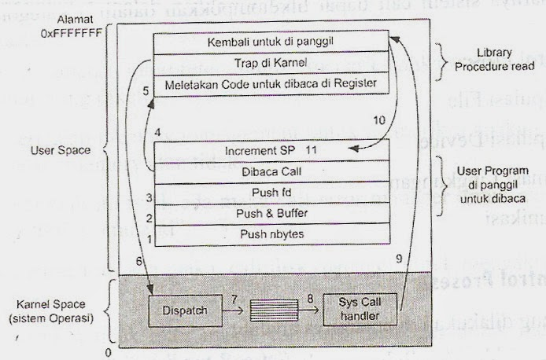

        Gambar Langkah-langkah Sistem Call

Tiga metode umum yang digunakan sebagai pass parameters antara program yang sedang dijalankan dengan sistem operasi:
* Pass Parameter dalam register
* Menyimpan parameter tersebut ke sebuah tabel didalam memori, dan alamat tabel dikenali sebagai sebuah parameter dalam register
* Push (penyimpanan) parameter ke antrian (stack) oleh program, dan diambil kembali dari antrian (pop off) oleh sistem operasi.

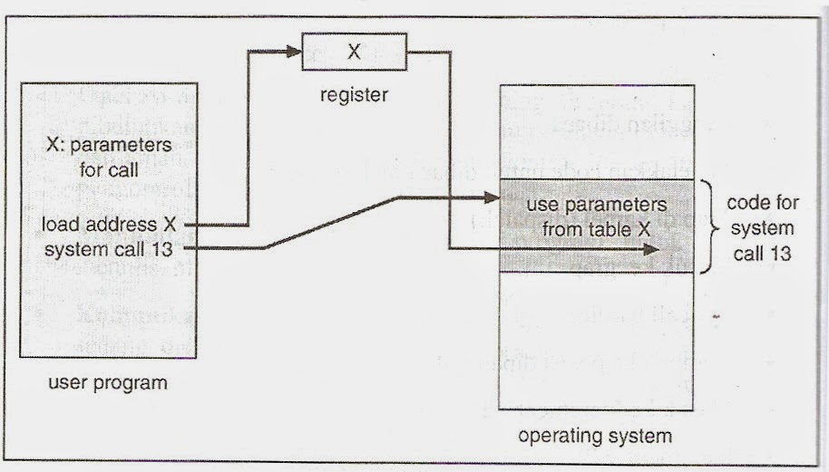

        Gambar Mengenali Parameter sebagai Teble

Pada dasarnya sistem call dapat dikelompokan dalam 5 kategori sebagai berikut:
* Kontrol proses
* Manipulasi File
* Manipulasi device
* Informasi Lingkungan
* Komunikasi

### Kontrol Proses
Hal-hal yang dilakukan diantaranya adalah:
* Mengakhiri (end) dan membatalkan
* Mengambil (load) dan eksekusi (execute)
* Membuat dan mengakhiri proses-proses
* Menentukan dan menggeser atribut proses
* Wait for Time
* Wait event, signal event
* Mengalokasikan dan membebaskan memori

Misalnya: Sistem Operasi pada MS-DOS menggunakan sistem singletasking yang memiliki command interpreter yang akan bekerja pada saat start. Karena singletasking, maka akan menggunakan metode yang sederhana untuk menjalankan program dan tidak akan membuat proses baru. Sistem operasi UNIX dapat menjalankan banyak program dan tidak membuat proses baru.

Contoh sebuah eksekusi program pada MS-DOS

A:\ Type file 1. text prn -> maksudnya cetak isi dari a:\file1.text ke printer, Komponen-komponen yang terlibat dalam program ini adalah:
* CPU
* Memory
* Keyboard
* Printer
* Disk

Pelaksanaan:
* Call Command interpreter untuk menenrjemahkan atau mengartikan perintah yang diketik,
* Call terhadap memory management untuk memeriksa apakah perintah > ada dalam memory atau tidak.
* Jika perintah itu tidak ada maka call error manager untuk menampilkan pesan "Bad Command".
* Jika perintah itu ada maka, call disk manager untuk mengaktifkan drive A. A:\>.
* Jika drive a tidak aktif maka, call error manager untuk menampilkan pesan kesalahan "Disk not Ready".
* Jika disk A aktif maka, check keberadaan file1.txt di disket dalam drive A.
* Jika file1.txt tidak ada maka, call error manager untuk menampilkan pesan "File not Found".
* Jika file1.txt ada maka, load file1.txt ke memori.
* Call memori manager untuk mencari tempat di memory untuk menampung file1.txt dan menempatkan pada space yang ada.
* Call command interpreter untuk check argument berikutnya (*>*),
* Jika argument berikutnya tidak sama dengan  ">" maka call error manager untuk menampilkasn pesan "Argument is not Match".
* Jika argument berikutnya sama dengan ">" maka, call Command interpreter untuk mengecek argument "prn".
* Jika argument tidak sama dengan "prn" maka, call error manager akan menampilkas pesan kesalahan "Argument is not Match".
* Jika argument berikutnya sama dengan "prn" maka call printer manager untuk mengecek apakah printer aktif.
* Jika printer tidak aktif maka, call error manager akan menampilkasn pesan kesalahan "Printer is not Ready".
* Jika printer aktif maka, call printer manager untuk mengecek apakah kertas ada atau tidak.
* Jika kertas ada maka, call memory untuk memindahkan isi dari file1.txt dari memori ke buffer printer.
* Printer akan mengambil per karakter dari buffer dan melakukan pencetakan sampai selesai pada karakter terakhir dari file1.txt.
* Setelah semua kegiatan selesai maka call command interpreter akan menampilkan A:\>.

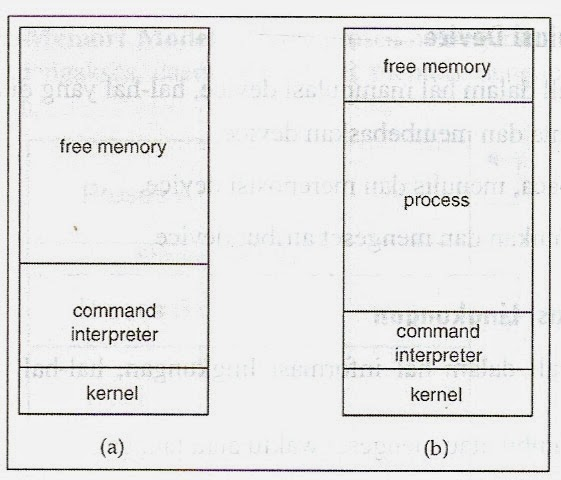

        Gambar Pelaksanaan Eksekusi pada MS-DOS (a) Pada saat Startup (b) Pada Saat Running

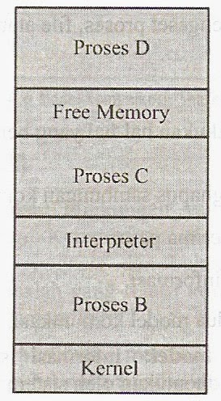

        Gambar Unix Menjalankan Lebih dari Satu Proses

### Manipulasi Device
Pada sistem call dalam hal manipulasi device, hal-hal yang dilakukan adalah:
* Meminta dan Membebaskan device,
* Membaca, menulis dan mereposisi device,
* Menentukan dan mengeset atribut device.

### Informasi Lingkungan
Pada sistem call dalam hal informasi lingkungan, hal-hal yang dilakukan adalah:
* Mengambil atau mengeset waktu dan tanggal,
* Mengambil atau mengeset sistem data,
* Mengambil atau mengeset proses, file atau atribut-atribut device.

### Komunikasi
Sistem call juga dapat melakukan hal-hal yang berhubungan dengan komunikasi seperti:
* Membuat dan menghapus sambungan komunikasi,
* Mengirim dan menerima pesan,
* Mentransfer status informasi.

### Pada komunikasi terdapat dua model komunikasi, yaitu:
* Message-Passing model: Informasi saling dilakukan melalui fasilitas yang telah ditentukan oleh sistem operasi.

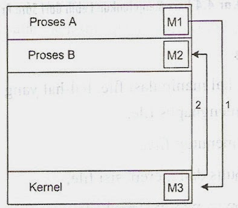

        Gambar Model Komunikasi "Message Passing"

* Shared-Memori Model: Proses-proses yang menggunakan map memori untuk mengakses daerah-daerah di memori dengan proses-proses yang lain

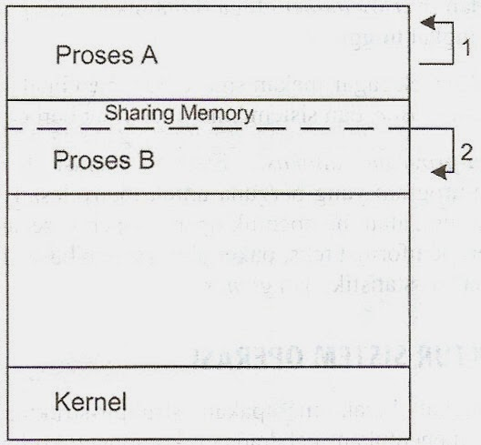

        Gambar Model Komunikasi "Shared-Memory"